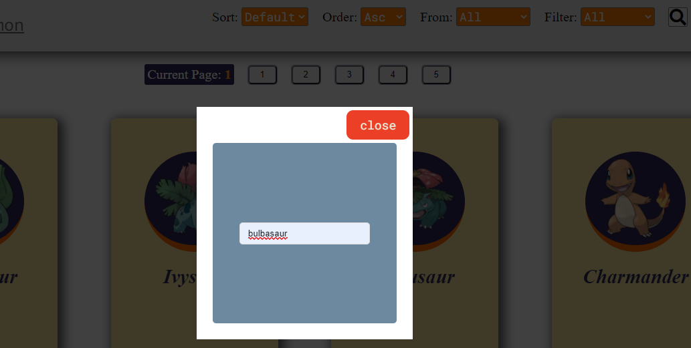

---

<h1 align="center";>App Pokemon</h1>


> **Description**: ***Single Page Application*** developed from the Frontend side with *React JS, Redux and Styled-Components*. And from the Backend side with *Node JS, Express JS, PostgreSQL and Sequelize.* 
>
> You also have to keep in mind that this application consumes the [pokeapi](pokeapi.co) api.

> **Installation**: Before run the application you need to create postegres database with the name `pokemon` and also `.env` file like follows.

```
DB_NAME=pokemon
DB_USER=youruser
DB_PASS=yourpass
DB_HOST=localhost
PORT=3001
```

#### Code Example

```js
// getPokemons.controller.js
const NUMBER_OF_REQUESTS_TO_THE_API = 50;

// call the api, then save the result in a cache
  if (!cache.getLength()) {
    const promises = [...Array(NUMBER_OF_REQUESTS_TO_THE_API + 1).keys()]
      .slice(1).map(id => fetchData(endpoint(id)));
    const listOfPokemons     = await Promise.all(promises);
    const pokemonsFromTheApi = filteringAndSortingData(listOfPokemons);
    cache.setValue(pokemonsFromTheApi);
  }

// using Sequelize
  const pokemonsFromTheDB = await Pokemon.findAll({
    include: {
      model: Type,
      attributes: ["id", "name"],
      through: {
        attributes: []
      }
    }
  });
```

```js
// Card component
import { Link } from "react-router-dom";
import {
  Main,
  CardContainer,
  Front,
  Back,
  Image,
  Box,
  List,
  Id,
} from "./Card.styles";

const Card = ({ id, name, types, image }) => {
  const sliceId = id => id.slice(0, 8).concat("...");

  return (
    <Main>
      <CardContainer>
        <Front>
          <Box>
            <Image image={image} />
          </Box>
          <h1>{name}</h1>
        </Front>
        <Back>
          <Id>
            <h3> Id: {typeof id === "number" ? id : sliceId(id)}</h3>
          </Id>
          <h2>{`${name}'s types`}</h2>
          <List>
            {types.slice(0, 4).map((type, index) => (
              <li key={index}>{type.name}</li>
            ))}
          </List>
          <Link to={`/details/${id}`}>Go to Details</Link>
        </Back>
      </CardContainer>
    </Main>
  );
};

export default Card;
```

```js
// App.js
import { withRouter } from "react-router-dom";
import Routes from "./routes/Routes";
import Navbar from "./components/navbar/Navbar";

import "./App.css";

const App = ({ location }) => {
  return (
    <>
      {location.pathname !== "/" && <Navbar />}
      <Routes />
    </>
  );
};

export default withRouter(App);
```

```js
// Routes.js
import { Switch, Route } from "react-router-dom";
import Landing from "./landing/Landing";
import Home from "./home/Home";
import Details from "./details/Details";
import PokemonForm from "./pokemonForm/PokemonForm";

const Routes = (_) => {
  return (
    <>
      <Switch>
        <Route exact path="/">
          <Landing message={"Who's that pokemon?"} />
        </Route>
        <Route path="/home" component={Home} />
        <Route path="/details/:id" component={Details} />
        <Route path="/form" component={PokemonForm} />
      </Switch>
    </>
  );
};

export default Routes;
```

### Below are images of the application in operation

#### The Home


#### Search Pokemon by Name



#### Result Search


#### Filter


